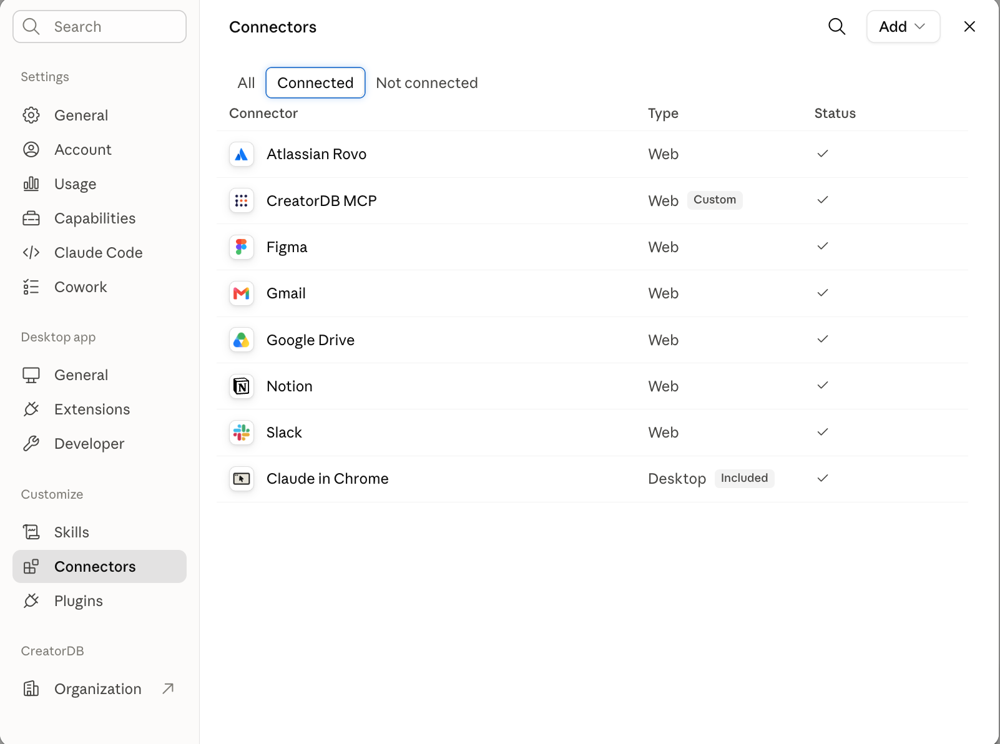
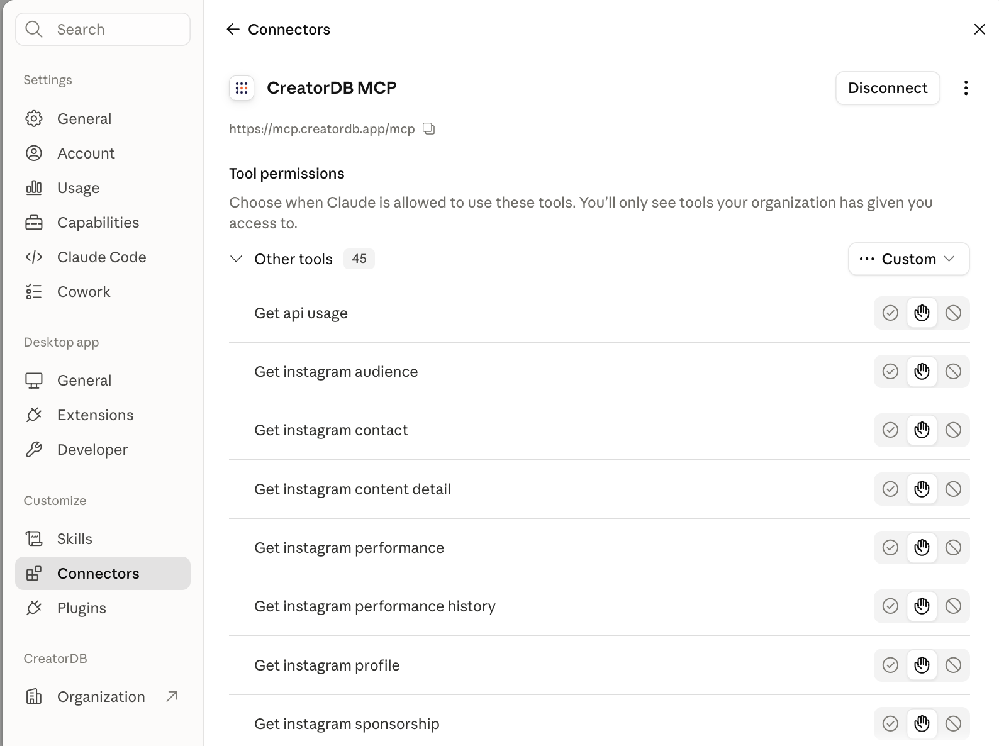
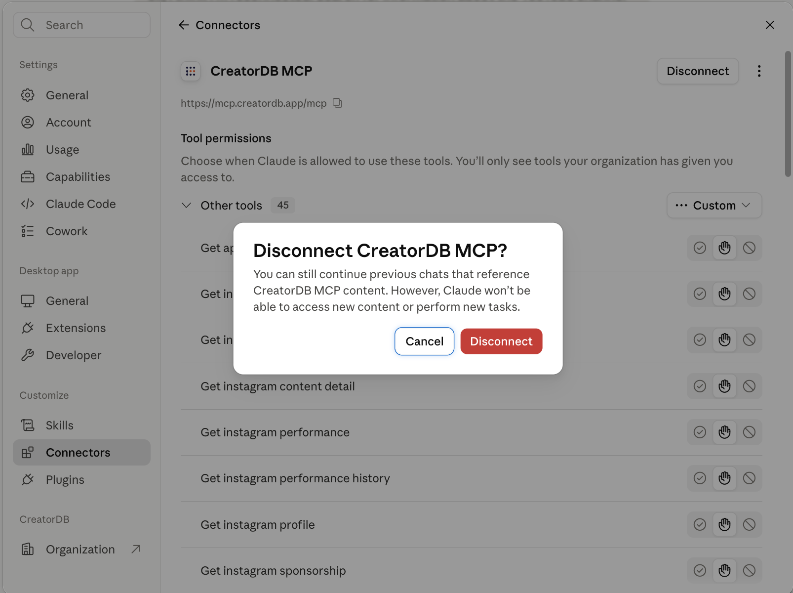
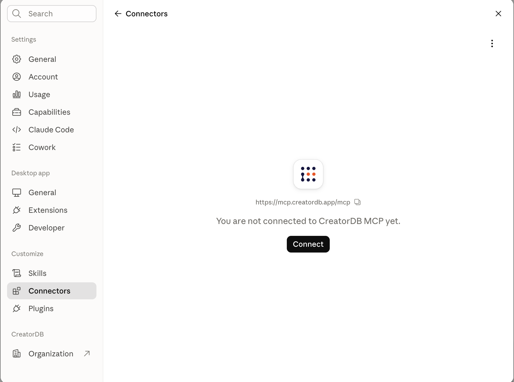
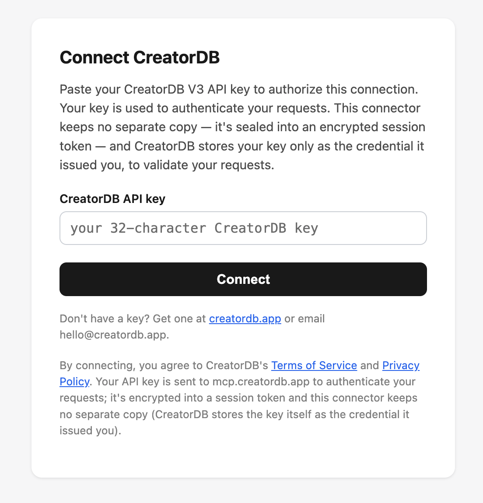
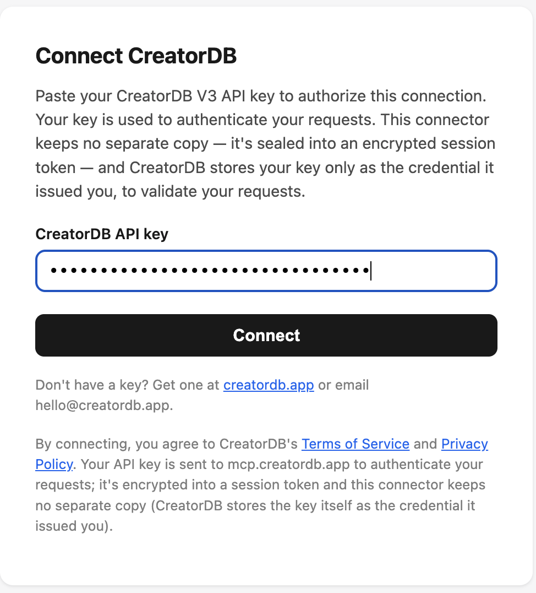
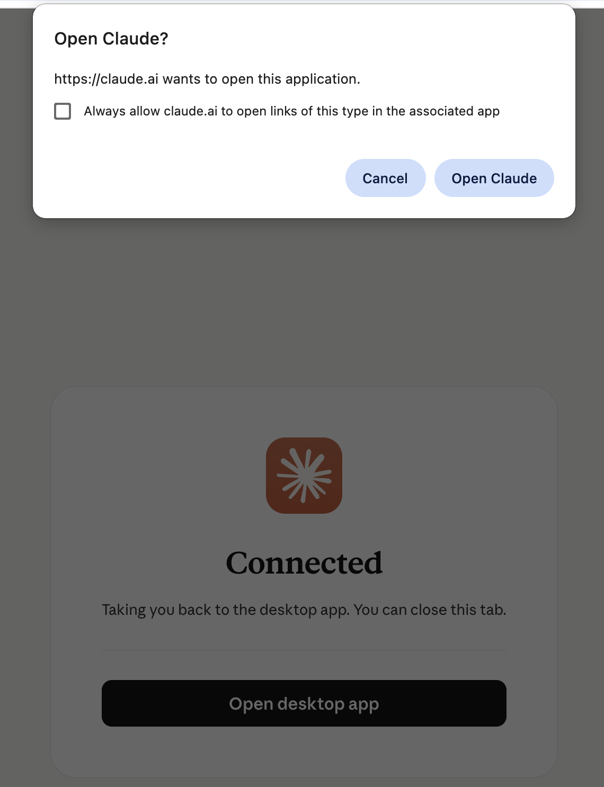
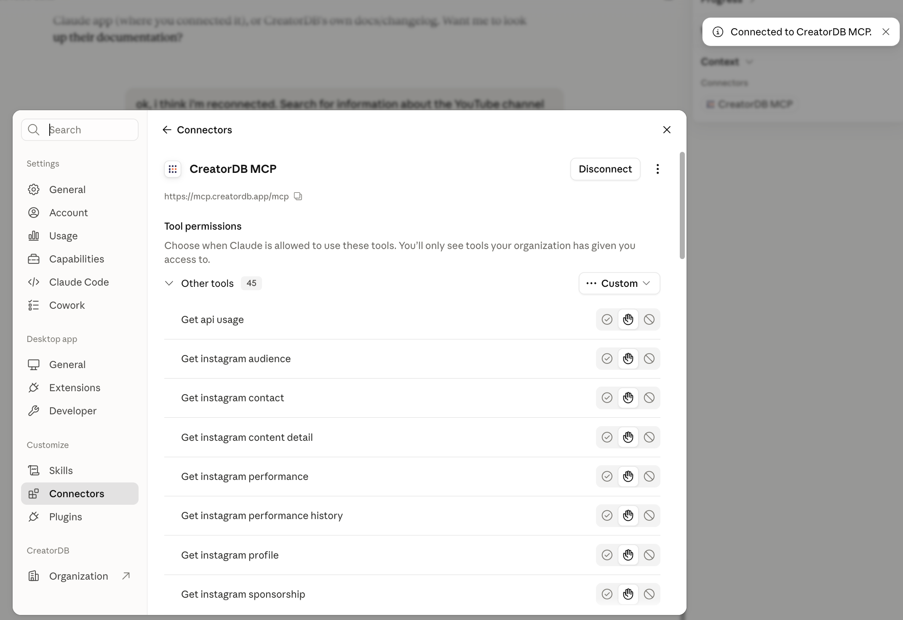

# Reconnecting the CreatorDB MCP connector

If you connected the CreatorDB MCP connector before **July 28, 2026**, reconnect it once
to pick up the latest tools. This takes about a minute and you can reuse your existing API key.

## Why reconnect

On July 28 we launched **fractional calls** on the CreatorDB v3 API. As part of that,
six creator-data endpoints — profile, performance, audience, contact, content-detail,
and sponsorship — moved from `GET` to `POST`. A connector that was set up before then
may be holding the old tool definitions, which can cause calls to fail with a **404**.

Reconnecting refreshes the tool set so that:

- Your calls route to the new endpoints correctly (no more 404s).
- You get the new **`fields`** options that let you request only the data you need and
  pay per field — capped so a subset never costs more than the full endpoint.
- You get the new **submit-creator** tools for adding creators to the index.

You do **not** need a new API key — use the same one you already have.

> **Which client are you using?** The screenshots below show the flow in the **Claude**
> app (web and desktop). The steps are the same idea in **ChatGPT** and other MCP-capable
> clients — remove/disconnect the connector and add it back with the same URL
> (`https://mcp.creatordb.app/mcp`) and key — but the menu names and screens differ. Look
> for your client's **Connectors** (or **Custom connectors** / **Integrations**) settings.

## Reconnect in Claude (web, desktop, or mobile)

These steps use the hosted connector at `https://mcp.creatordb.app/mcp`.

**1. Open Settings → Connectors** and find **CreatorDB MCP** in your connected list.

**2. Click CreatorDB MCP** to open its detail page. You'll see the URL
`https://mcp.creatordb.app/mcp` and a **Disconnect** button.

**3. Click Disconnect**, then confirm **Disconnect** in the dialog. Existing chats that
already reference CreatorDB stay readable — this only stops new calls.

**4. The connector now shows "You are not connected to CreatorDB MCP yet."** Click **Connect**.

**5. On the Connect CreatorDB screen, paste your CreatorDB v3 API key** (the same one you
already use) and click **Connect**.

**6. If you're on the desktop app, approve the "Open Claude?" browser prompt.** You'll see a
**Connected** confirmation and can close the tab.

**7. Back in Settings → Connectors, CreatorDB MCP shows a checkmark** and a
**"Connected to CreatorDB MCP"** confirmation appears. You're done.

**8. Start a new conversation.** The refreshed tools load when a chat begins, so an existing
chat may still reference the old ones.

> Tip: if you'd rather not disconnect, removing and re-adding the connector with the URL
> `https://mcp.creatordb.app/mcp` achieves the same refresh. Disconnect → Connect is the
> most reliable path.

## Local install (Claude Desktop, Claude Code, Cursor via `npx`)

If you run the connector locally instead of the hosted URL, "reconnecting" means updating
the package rather than toggling a connector:

1. Make sure your MCP config runs the package with `@latest`, for example:
   `npx -y @creatordbai/mcp-server@latest`
   (If you pinned a specific version, update it to `1.5.0` or later.)
2. **Fully restart your client** (⌘Q and reopen Claude Desktop, restart Cursor, etc.).
   MCP clients only read the package and key at startup.

Your API key doesn't change here — it's read from your existing MCP configuration.

## Still seeing 404s after reconnecting?

- Confirm you started a **new conversation** after reconnecting.
- Confirm the connector URL is exactly `https://mcp.creatordb.app/mcp`.
- Check the service is up: <https://mcp.creatordb.app/health> should return `{"status":"ok",...}`.
- If it persists, reply to your CreatorDB contact or email `hello@creatordb.app`.
